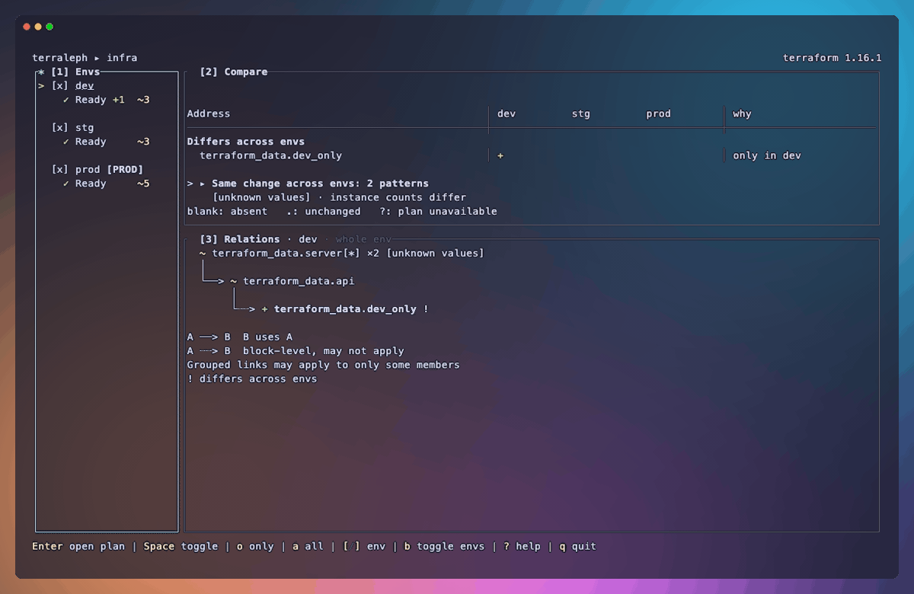

# Terraleph ☕

Review Terraform or OpenTofu plans in your terminal and apply the exact plan you reviewed.



## Features

- **Plan review**: Full plan display, scrolling, and keyword filtering
- **Change overview**: Grouped resource changes and a relationship graph
- **Environment comparison**: Plans from multiple environments, side by side
- **Apply confirmation**: Check the target and workspace before applying
- **Apply progress**: Resource status and logs
- **Clipboard**: Copy the full plan or apply results


## Installation

```sh
# Homebrew
brew install riii111/terraleph/terraleph

# mise
mise use -g github:riii111/terraleph

# Cargo
cargo install --locked terraleph

# Nix
nix run github:riii111/terraleph
```

Prebuilt binaries are also available on the [Releases](https://github.com/riii111/terraleph/releases) page.

## Usage

Run in an interactive terminal with Terraform or OpenTofu installed and credentials configured. Start in your configuration directory, or a parent directory to compare environments. Terraleph runs `init` before planning when needed.

```sh
# Open the change overview
terraleph

# Review a plan
terraleph plan

# Review a plan and confirm apply
terraleph apply

# Use OpenTofu
terraleph tofu plan
terraleph tofu apply

# Specify environment directories
terraleph --env-dir envs/prod --env-dir envs/stg
```

In the environment comparison, choose what to plan before any commands run:

- `p`: Plan the selected environment
- `P`: Plan all environments
- `a` (in plan review): Apply the reviewed plan

### Environment discovery

In Git repositories, Terraleph finds environments at any depth, excluding ignored directories and submodules. Outside Git, or when Git lists no configuration, it searches up to 4 levels down.

### Initialization and HCP Terraform

- Run `init` yourself if you need `-migrate-state`, `-reconfigure`, or `-upgrade`.
- HCP Terraform: Local execution mode supports terminal review and apply. For Remote and Agent modes, Terraleph directs you to HCP Terraform.
- HCP workspace checks require a Terraform CLI token (`TF_TOKEN_*`, CLI configuration, or `terraform login`). Credential helpers are unsupported.

### Shell aliases

To use Terraleph with your usual commands:

```sh
alias terraform='terraleph terraform'
alias tofu='terraleph tofu'
```

### Clipboard over SSH

When a system clipboard is unavailable, `y` copies through your terminal using OSC 52. In tmux, enable this with `set -g set-clipboard on`.

---

P.S. The day I named this tool, I had an Ethiopian coffee made from Heleph beans, and it really calmed me down. Later I found out "Heleph" means something like *change*. A Terraform plan is basically a list of changes, so the name just stuck.
